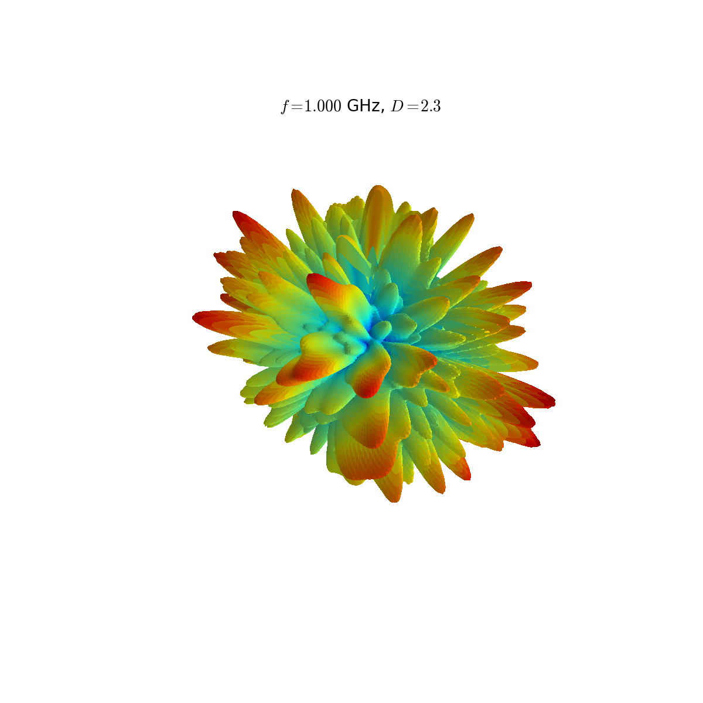
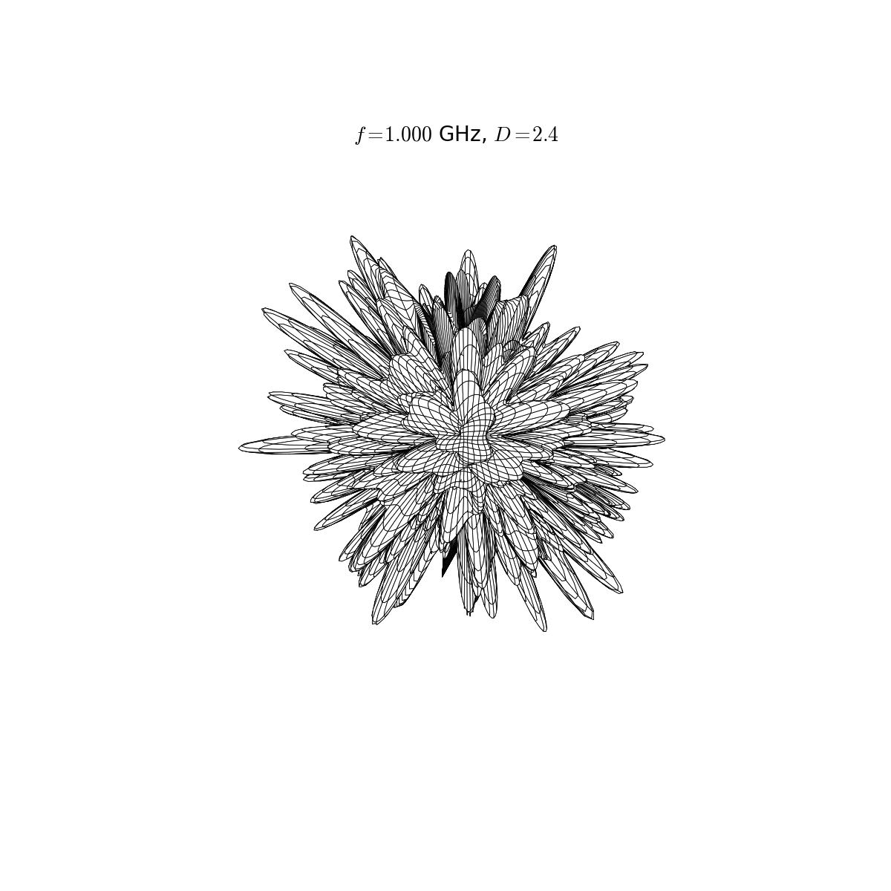

RandomEUT
=========

Overview
--------
Computes the radiation pattern of a random equipment under test made of Hertzian dipoles on a sphere.
Directivity is computed and the radiation pattern is printed in a file.

Packages required
-----------------
* Python 2.x
* Numpy
* Matplotlib

Output samples
--------------

